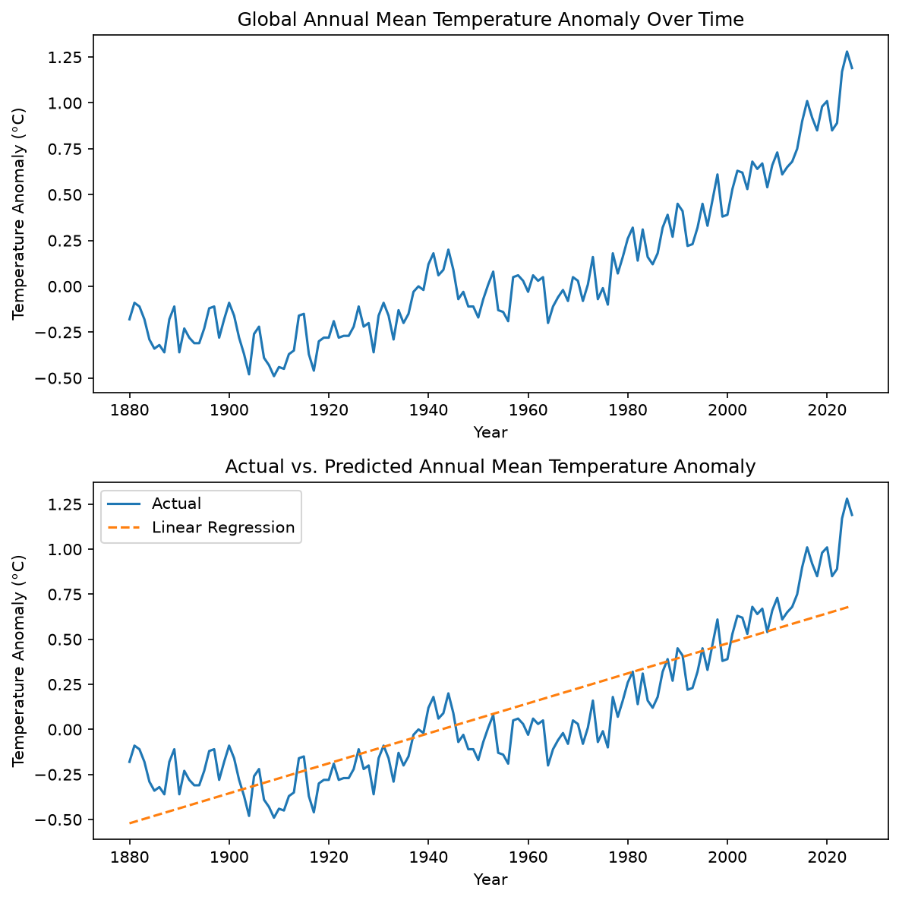

# Climate Data Analysis

Analysis of global annual mean temperature anomalies (1880–present) using the NASA GISTEMP dataset.

## What it does

- Loads and cleans the GISTEMP CSV data
- Visualizes the temperature anomaly trend over time
- Fits a linear regression model to estimate the warming trend

## Data source

[NASA GISTEMP](https://data.giss.nasa.gov/gistemp/) — `GLB.Ts+dSST.csv`

## Results

The model estimates a warming trend of approximately **0.0083°C per year** (~0.83°C per century).



## Setup

```bash
pip install -r requirements.txt
```

## Usage

```bash
python climate_analysis.py
```